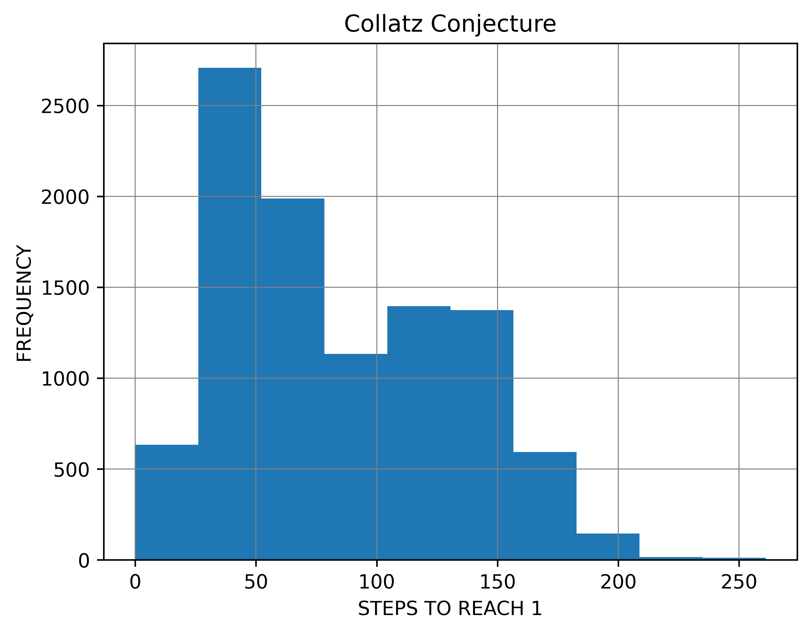

# Collatz Conjecture

The Collatz conjecture is an open conjecture in mathematics named so after Lothar Collatz who proposed it in 1937. It is also known as 3n + 1 conjecture, the Ulam conjecture (after Stanislaw Ulam), Kakutani’s problem (after Shizuo Kakutani) and so on.

## Graph

## Histogram

## Inference on basis of above graphs
* The powers of two converge to one quickly because 2n is halved n times to reach one, and is never increased.
* We can observe that no two integers are repeated in cycle
* We can see in the histogram that the number of steps exceed more 100 than hundred only once for the given input range.
